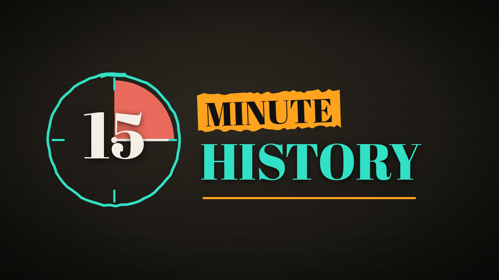

# 15 Minute History: style



Everything that makes a 15 Minute History video look and sound like one: the logo, colours and fonts, every music cue and
sound effect, the on-screen techniques, the writing and packaging conventions, and a tested starter project. It was collected from
all the videos so far: *Fix Everything*, *The War Nobody Won*, the Ambrose Bierce video, *King Andrew*, *Grip Tighter* and *Good Luck*.

**The look in one paragraph.** A researcher's desk at night. Black-and-white archival engravings and photographs sit on dark, faintly
ruled paper. One figure per image is tinted coral and circled with a loose, hand-traced teal outline. Titles are heavy serif caps
stamped onto torn strips of orange tape. Lowercase handwritten teal notes and bowed arrows explain the picture. Drawn marks move at a
choppy 12 drawings a second while the camera glides. Every cut is hard and lands on a spoken word. The voice is plain, quick and a
little wry, and it gets quieter and slower when the subject is suffering.

## What's here

| Folder | What's in it |
|---|---|
| [`brand/`](brand/) | Logo files (wordmark, profile picture, banner, watermark, the intro and logo-break videos), colours, fonts, and every thumbnail so far |
| [`music/`](music/) | **38 music cues**, one copy each, grouped by feeling, with length, loudness, the prompt that made each, and where it was used |
| [`sfx/`](sfx/) | 18 sound effects with what each is for and its volume |
| [`techniques/`](techniques/) | Every on-screen technique by purpose, 20-frame look books of each video, and component code not yet in the template |
| [`videos/`](videos/) | The catalog of past videos, what each added, and **your standing preferences** gathered from your notes |
| [`examples/`](examples/) | Each video's working documents: script, fact-check, image and music prompts, YouTube text, handoff |
| [`.claude/skills/15-minute-history/`](.claude/skills/15-minute-history/) | The Claude skill that makes a video end to end, its reference guides, and the starter project |

## The guides

The detailed guides live inside the skill, so Claude reads them while it works, and you can read them too:

- [Visual style guide](.claude/skills/15-minute-history/references/visual-style.md): the palette, type, every component with exact values, motion, layout, and the logo
- [Writing the script](.claude/skills/15-minute-history/references/script-writing.md): shape, voice, objectivity rules, fact-check flags, pronunciation
- [Voice, music and sound](.claude/skills/15-minute-history/references/voice-and-audio.md): the voice clone, the locked pace, music levels
- [Images and masks](.claude/skills/15-minute-history/references/images-and-masks.md): archival sources, the AI painting style paragraph, coral/teal masks
- [Building the scenes](.claude/skills/15-minute-history/references/building-scenes.md): timing to words, the component cheat sheet, scene recipes
- [Render and deliver](.claude/skills/15-minute-history/references/render-and-deliver.md): render, master to −14 LUFS, previews, the 1080p master
- [Thumbnail and YouTube](.claude/skills/15-minute-history/references/thumbnail-and-youtube.md): the thumbnail formula, title, description, chapters, tags
- [Classroom handout](.claude/skills/15-minute-history/references/classroom-handout.md): the simple 10–12 question viewing guide

## Making a new video

Start a Claude Code session with this repo attached (plus a new, empty repo for the video), and ask for the video in your own words:
*"Make a 15 Minute History video about the Mexican-American War."* The skill loads from this repo and works in phases. It checks with you
before anything that costs credits or hours: script, pronunciation test, voice, images, scenes, render, thumbnail, YouTube text.

To start a project by hand:

```sh
sh .claude/skills/15-minute-history/scripts/new_project.sh ../my-video/video My_Video
cd ../my-video/video
npx remotion studio
```

That copies the starter project (kit, tools, fonts, core sound effects, the title sting, the 1836 map and two example chapters), writes
placeholder narration so it previews at once, and installs the packages. It was tested on 2026-10-08: a fresh project installs,
type-checks, and renders chapter stills, thumbnails and the logo files.

Keys (ElevenLabs for the voice, Gemini for paintings) go in the project's `.env`, never in a repo or a chat.

## Keeping it up to date

When a video is finished, add what it made here, so the next one starts from it:
- new music cues to `music/cues/` with the video's prefix, plus a row in `music/README.md` and `music/catalog.json`
- new sound effects to `sfx/`
- the chosen thumbnail to `brand/thumbnails/`
- a look book: `python3 .claude/skills/15-minute-history/scripts/lookbook.py <720p.mp4> techniques/lookbook/NN_Name.jpg "Title"`
- its script, prompts and YouTube text to `examples/`
- any new component to `techniques/components/`, or into the template's kit once it has proved itself

Claude will offer to do this at the end of each video.
